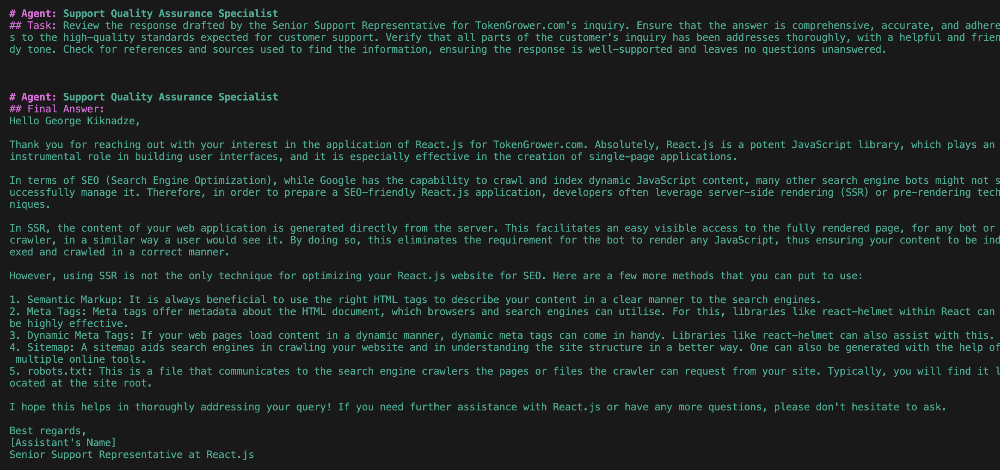

# CustomerSupport Crew

by George Kiknadze




A powerful AI-powered customer support automation system that leverages [crewAI](https://crewai.com) to provide intelligent, collaborative support responses. This project creates a virtual support team consisting of a Senior Support Representative and a Quality Assurance Specialist who work together to handle customer inquiries with precision and care.

## What it Does

This project creates an automated customer support workflow that:
- Processes and responds to customer inquiries using AI agents
- Provides detailed, well-researched responses through a senior support representative
- Ensures quality through a dedicated QA specialist who reviews and refines responses
- Maintains a friendly, professional tone while delivering comprehensive solutions
- References relevant documentation and sources in responses

## Why Use It

- **Consistency**: Ensures every response meets high-quality standards
- **Efficiency**: Automates the support process while maintaining personal touch
- **Quality Assurance**: Built-in review process for accuracy and completeness
- **Scalability**: Handles multiple inquiries with consistent quality
- **Documentation**: Automatically includes relevant references and sources

## Installation

Ensure you have Python >=3.10 <3.13 installed on your system. This project uses [UV](https://docs.astral.sh/uv/) for dependency management and package handling, offering a seamless setup and execution experience.

First, if you haven't already, install uv:

```bash
pip install uv
```

Next, navigate to your project directory and install the dependencies:

(Optional) Lock the dependencies and install them by using the CLI command:
```bash
crewai install
```
### Customizing

**Add your `OPENAI_API_KEY` into the `.env` file**

- Modify `src/customer_support/config/agents.yaml` to define your agents
- Modify `src/customer_support/config/tasks.yaml` to define your tasks
- Modify `src/customer_support/crew.py` to add your own logic, tools and specific args
- Modify `src/customer_support/main.py` to add custom inputs for your agents and tasks

## Running the Project

To kickstart your crew of AI agents and begin task execution, run this from the root folder of your project:

```bash
$ crewai run
```

This command initializes the customer_support Crew, assembling the agents and assigning them tasks as defined in your configuration.

This example, unmodified, will run the create a `report.md` file with the output of a research on LLMs in the root folder.

## Understanding Your Crew

The customer_support Crew is composed of multiple AI agents, each with unique roles, goals, and tools. These agents collaborate on a series of tasks, defined in `config/tasks.yaml`, leveraging their collective skills to achieve complex objectives. The `config/agents.yaml` file outlines the capabilities and configurations of each agent in your crew.

## Support

For support, questions, or feedback regarding the CustomerSupport Crew or crewAI.
- Visit our [documentation](https://docs.crewai.com)
- Reach out to us through our [GitHub repository](https://github.com/joaomdmoura/crewai)
- [Join our Discord](https://discord.com/invite/X4JWnZnxPb)
- [Chat with our docs](https://chatg.pt/DWjSBZn)

Let's create wonders together with the power and simplicity of crewAI.
